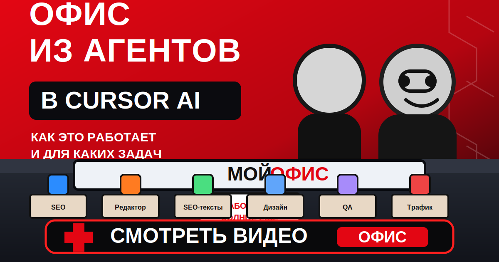
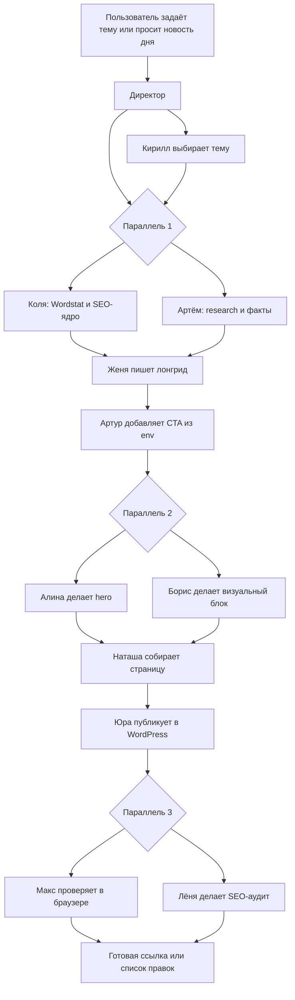
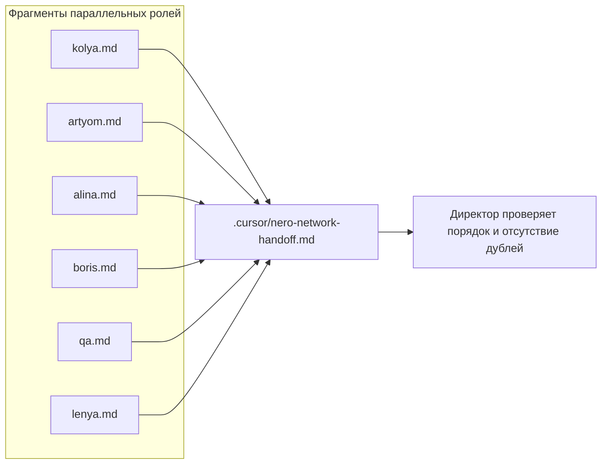
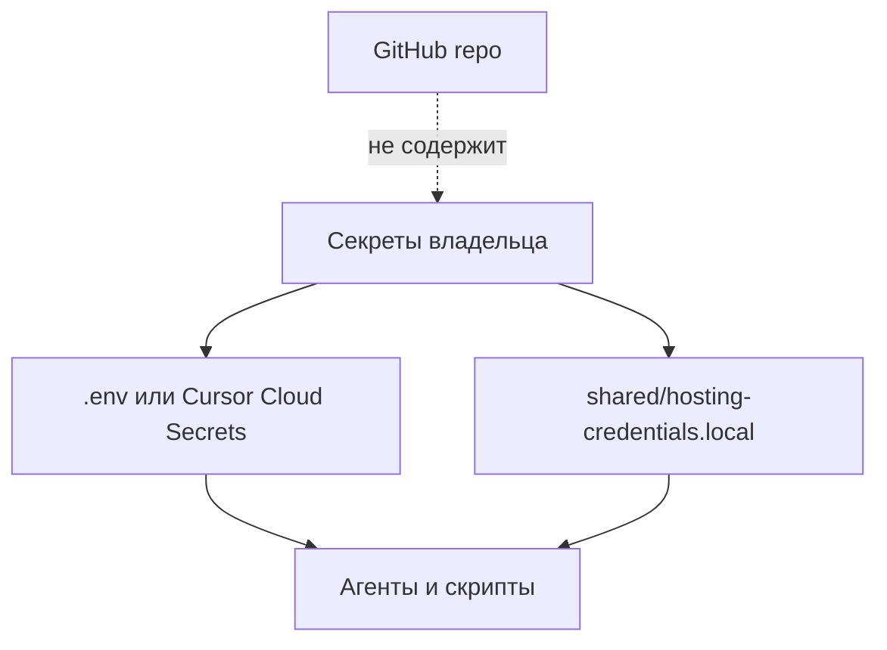

# Nero Network Office Page 0.2

[](https://mave.stream/e/1AnET5OvA23)

[Смотреть подкаст «Офис из агентов в Cursor AI»](https://mave.stream/e/1AnET5OvA23)

**Nero Network Office Page** — переносимый Cursor-плагин для команды AI-агентов, которые готовят и публикуют SEO-страницы на WordPress: от темы и семантики до лонгрида, hero-анимации, визуального блока, FTP/SSH-публикации, QA и SEO-аудита.

Плагин сделан как отдельный репозиторий, безопасный для передачи другим людям: все домены, доступы, тема WordPress, CTA и рекламные ссылки настраиваются через env/secrets и не хранятся в коде.



## Что умеет

- Находит тему или принимает готовую тему от пользователя.
- Собирает SEO-ядро и структуру через Wordstat.
- Делает research, факты, источники и конкурентный контекст.
- Пишет длинный SEO/GEO-лонгрид.
- Добавляет CTA, рекламные вставки и баннеры только из настроек владельца.
- Создаёт hero-блок и отдельный визуальный блок в статье.
- Собирает финальную WordPress-страницу.
- Публикует `page-{slug}.php` через FTP/SSH в активную тему WordPress.
- Проверяет страницу в браузере, консоль, адаптив, `alt`, ссылки и SEO.

## Для кого

Плагин подходит, если нужно передать другому человеку готовый “офис агентов” для WordPress-публикаций:

- агентство контента;
- SEO/GEO-команда;
- владелец WordPress-сайта;
- команда, которая работает в Cursor и хочет повторяемый пайплайн страниц;
- self-hosted worker или Cursor Cloud Automation.

## Состав репозитория

```text
nero-network-office-page/
├── .cursor-plugin/
│   └── plugin.json
├── agents/
│   ├── director.md
│   ├── kirill.md
│   ├── seo-kolya.md
│   ├── artyom.md
│   ├── zhenya.md
│   ├── artur.md
│   ├── alina.md
│   ├── boris.md
│   ├── natasha.md
│   ├── yura.md
│   ├── qa.md
│   └── lenya.md
├── skills/
│   ├── director-nero-network/
│   ├── seo-agent-kolya/
│   ├── researcher-artyom/
│   ├── seo-writer-zhenya/
│   ├── publisher-yura/
│   └── ...
├── rules/
├── commands/
├── shared/
│   ├── hosting-credentials.env.example
│   ├── hosting-credentials.local.example
│   └── credentials.py
├── scripts/
│   ├── first-run.py
│   └── check-config.py
├── wordpress/
│   └── page-nero-network-office-example.php
├── docs/
│   └── AGENTS-SCHEME.md
├── INSTALL.md
├── SETUP.md
└── RELEASE-CHECKLIST.md
```

## Агенты

| Этап | Агент | Что делает | Результат |
| --- | --- | --- | --- |
| 0 | Директор | Оркестрирует весь процесс, запускает роли и проверяет handoff. | Управляемый пайплайн без гонок. |
| 1 | Кирилл | Ищет свежую тему или проверяет тему пользователя. | Выбранный инфоповод. |
| 2A | Коля | Делает Wordstat, SEO-ядро, мета и структуру. | Семантика и план. |
| 2B | Артём | Делает research, факты, источники и конкурентов. | Фактура для текста. |
| 3 | Женя | Пишет лонгрид 8k-20k+ знаков. | Готовый текст страницы. |
| 4 | Артур | Вставляет CTA и рекламу из env/secrets. | Конверсионные блоки. |
| 5A | Алина | Делает hero-секцию с canvas-анимацией. | Первый экран. |
| 5B | Борис | Делает визуальный блок в теле статьи. | Второй визуальный блок. |
| 6 | Наташа | Собирает финальную страницу. | HTML/PHP-шаблон. |
| 7 | Юра | Публикует через FTP/SSH в WordPress. | Живая страница. |
| 8A | Макс | Проверяет страницу в браузере. | QA-отчёт. |
| 8B | Лёня | Делает SEO-аудит. | SEO/GEO-отчёт. |

Подробная схема: `docs/AGENTS-SCHEME.md`.

## Handoff

Параллельные агенты не пишут в один файл одновременно. Они сохраняют результаты во фрагменты, а Директор переносит их в общий handoff.



## Быстрый старт

```powershell
git clone https://github.com/Horosheff/nero-network-office-page.git
cd nero-network-office-page
python .\scripts\first-run.py
python .\scripts\check-config.py --local
```

`first-run.py` создаёт `.env` и `shared/hosting-credentials.local` из `.example`-файлов, не перезаписывая существующие настройки. Для пересоздания используйте `python .\scripts\first-run.py --force`.

Подключить в Cursor:

```powershell
Copy-Item -Recurse -Force ".\nero-network-office-page" "$env:USERPROFILE\.cursor\plugins\local\nero-network-office-page"
```

Или для разработки сделать symlink:

```powershell
New-Item -ItemType SymbolicLink `
  -Path "$env:USERPROFILE\.cursor\plugins\local\nero-network-office-page" `
  -Target "C:\path\to\nero-network-office-page"
```

После этого перезапустите Cursor или выполните `Developer: Reload Window`.

## Настройка

Минимальный набор переменных:

```env
SITE_BRAND=
SITE_NICHE=
WP_SITE_URL=
PUBLIC_SITE_URL=
WP_THEME_SLUG=
REMOTE_SITE_ROOT=
FTP_HOST=
FTP_USER=
FTP_PASSWORD=
SSH_HOST=
SSH_USER=
SSH_PASSWORD=
```

CTA и реклама:

```env
PRIMARY_CTA_LABEL=
PRIMARY_CTA_URL=
SECONDARY_CTA_LABEL=
SECONDARY_CTA_URL=
AD_BANNER_URL=
AD_BANNER_IMAGE_URL=
AD_BANNER_ALT=
```

Проверка без сетевых подключений:

```powershell
python scripts/check-config.py --local
```

Проверка сайта, FTP, SSH и темы:

```powershell
python scripts/check-config.py --local --network
```

## WordPress-публикация

Юра публикует страницу как `page-{slug}.php` в активную тему WordPress. Тема задаётся через `WP_THEME_SLUG`, но перед загрузкой агент обязан проверить фактический `stylesheet/template` и путь `get_stylesheet_directory()`.

Для первой ручной проверки есть нейтральный шаблон:

`wordpress/page-nero-network-office-example.php`

Загрузите его в активную тему, создайте страницу в WordPress и выберите шаблон `Nero Network Office Example`.

## Безопасность



В репозиторий не должны попадать:

- `.env`
- `shared/hosting-credentials.local`
- приватные ключи;
- `node_modules`;
- `deliverables`;
- `output`;
- одноразовые публикационные файлы.

`.gitignore` уже настроен под эти ограничения.

## Документы

- `INSTALL.md` — подробная установка.
- `SETUP.md` — короткий чеклист настройки.
- `CLOUD-AUTOMATION.md` — Cursor Cloud и self-hosted worker.
- `docs/AGENTS-SCHEME.md` — схема агентов и handoff.
- `RELEASE-CHECKLIST.md` — проверка перед передачей другим людям.

## Первый запрос в Cursor

```text
Создай WordPress-страницу через Nero Network Office Page по теме: <тема страницы>
```

Если доступы не заполнены, публикатор должен остановиться с блокером и не просить пароли в чате.
