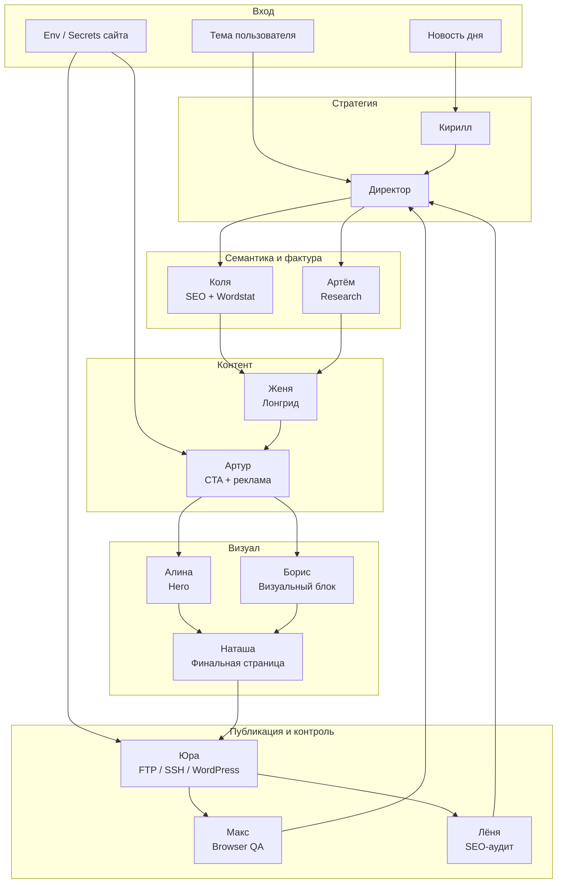
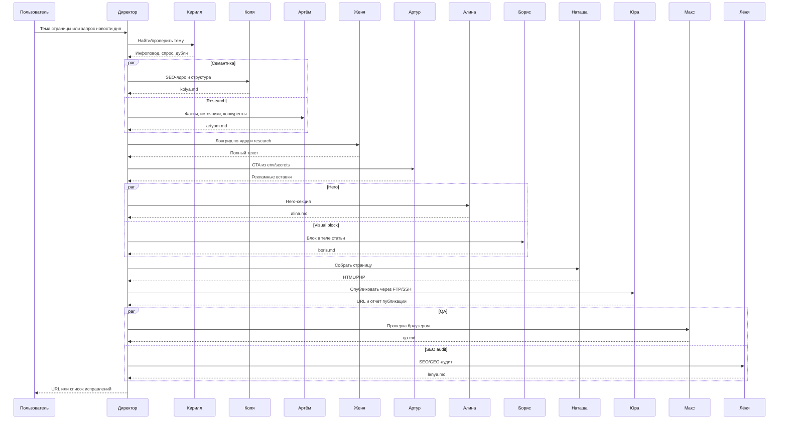
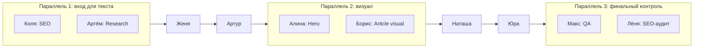
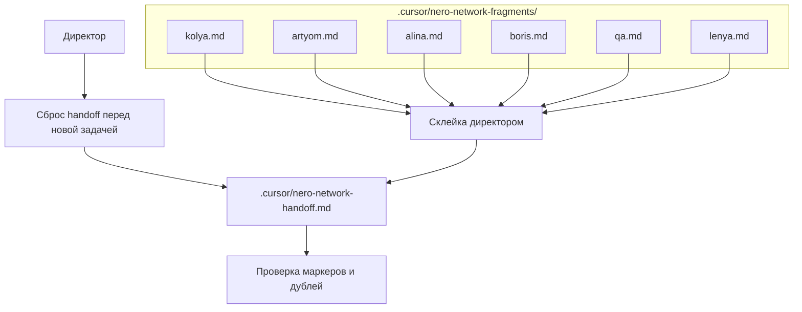
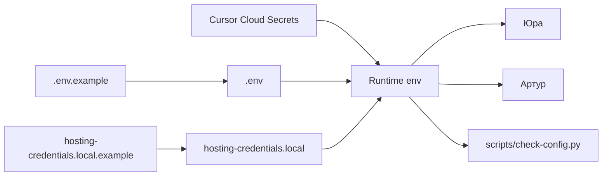
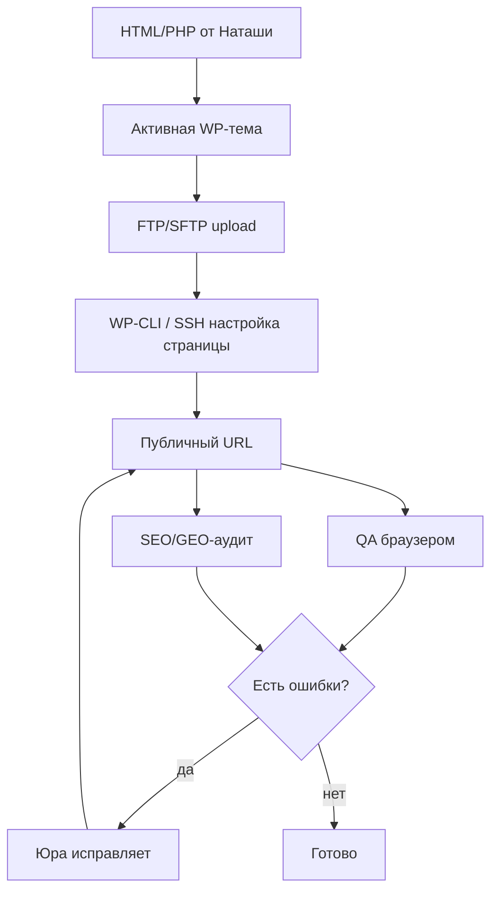
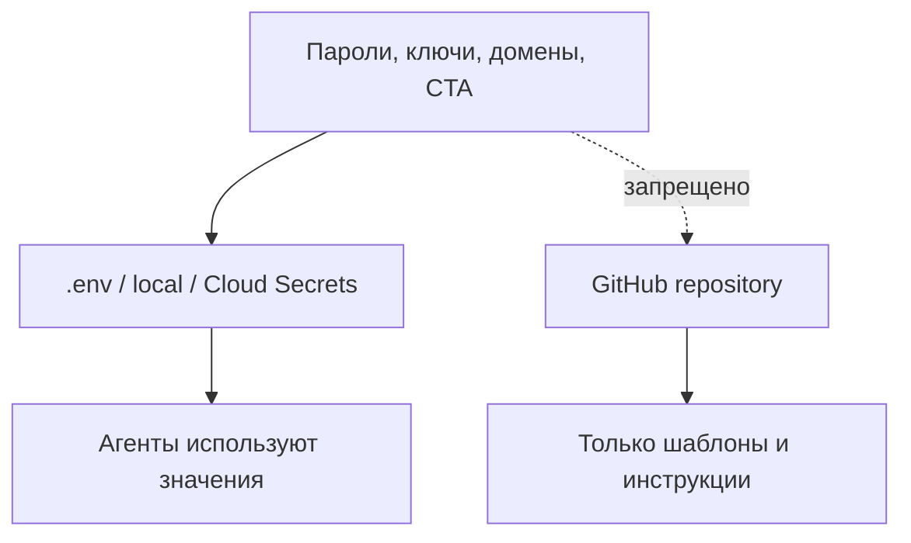

# Схема агентов Nero Network Office Page

Это карта “офиса”: кто за что отвечает, какие роли можно запускать параллельно, где лежит handoff и какие настройки нужны для переноса плагина на другой WordPress-сайт.

## Архитектура



## Пайплайн по шагам



## Матрица ролей

| Роль | Агент | Skill | Вход | Выход |
| --- | --- | --- | --- | --- |
| Оркестратор | `director` | `director-nero-network` | ТЗ пользователя, handoff, фрагменты | Управляемый пайплайн |
| Разведчик темы | `kirill` | `news-scout-kirill` | Тема или запрос новости дня | Инфоповод, спрос, дубли |
| SEO-семантик | `seo-kolya` | `seo-agent-kolya` | Тема | Ядро, мета, структура |
| Исследователь | `artyom` | `researcher-artyom` | Тема | Факты, источники, конкуренты |
| Копирайтер | `zhenya` | `seo-writer-zhenya` | SEO + research | Лонгрид |
| Рекламщик | `artur` | `advertiser-artur` | Лонгрид + env CTA | CTA и рекламные блоки |
| Hero-аниматор | `alina` | `animator-alina` | Тема + текст + CTA | Hero-секция |
| Визуальный редактор | `boris` | `animator-boris` | Тема + текст | Блок в теле статьи |
| Дизайнер страницы | `natasha` | `designer-natasha` | Текст + hero + блок Бориса | Финальная страница |
| Публикатор | `yura` | `publisher-yura` | HTML/PHP + env доступы | Живая WP-страница |
| QA | `qa` | `qa-checker` | URL | Browser QA |
| SEO-аудитор | `lenya` | `seo-auditor-lenya` | URL | Google/Yandex/GEO-аудит |

## Параллельные блоки



Параллель безопасна только потому, что роли пишут в разные фрагменты, а не в один общий файл.

## Handoff



Итоговый файл:

`<PROJECT_ROOT>/.cursor/nero-network-handoff.md`

Фрагменты:

`<PROJECT_ROOT>/.cursor/nero-network-fragments/`

Ожидаемые фрагменты:

- `kolya.md`
- `artyom.md`
- `alina.md`
- `boris.md`
- `qa.md`
- `lenya.md`

## Конфигурация сайта



Обязательные переменные:

- `SITE_BRAND`
- `SITE_NICHE`
- `WP_SITE_URL`
- `PUBLIC_SITE_URL`
- `WP_THEME_SLUG`
- `REMOTE_SITE_ROOT`
- `FTP_HOST`, `FTP_USER`, `FTP_PASSWORD`
- `SSH_HOST`, `SSH_USER`, `SSH_PASSWORD`

Опциональные переменные:

- `PRIMARY_CTA_LABEL`, `PRIMARY_CTA_URL`
- `SECONDARY_CTA_LABEL`, `SECONDARY_CTA_URL`
- `AD_BANNER_URL`, `AD_BANNER_IMAGE_URL`, `AD_BANNER_ALT`

Проверка:

```powershell
python scripts/check-config.py --local
python scripts/check-config.py --local --network
```

## WordPress lifecycle



Ключевое правило: страницы с `<script>` и `<canvas>` публикуются через PHP-шаблон в теме, а не через WordPress REST API.

## Безопасность



Нельзя коммитить:

- `.env`
- `shared/hosting-credentials.local`
- приватные ключи;
- `node_modules`;
- `deliverables`;
- `output`;
- одноразовые публикационные PHP/FTP/SSH-скрипты.

## Первый запуск

1. Установить плагин в Cursor.
2. Скопировать `shared/hosting-credentials.local.example` в `shared/hosting-credentials.local`.
3. Заполнить переменные сайта.
4. Выполнить `python scripts/check-config.py --local`.
5. Выполнить `python scripts/check-config.py --local --network`.
6. Проверить шаблон `wordpress/page-nero-network-office-example.php`.
7. Запустить задачу в Cursor:

```text
Создай WordPress-страницу через Nero Network Office Page по теме: <тема>
```
